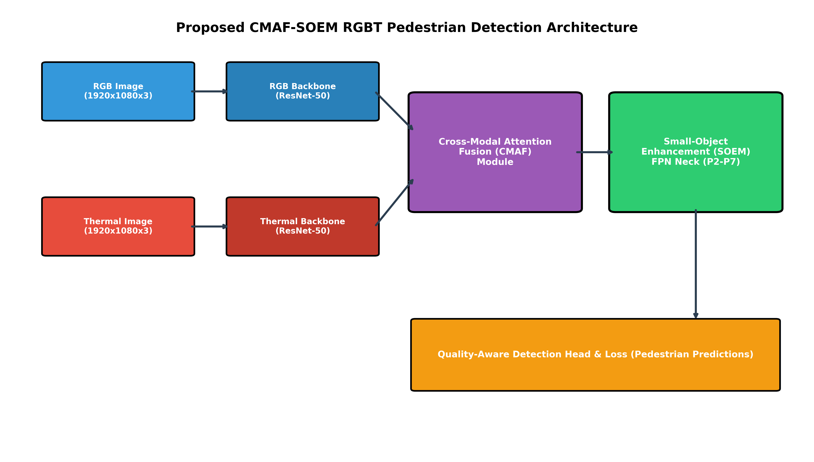
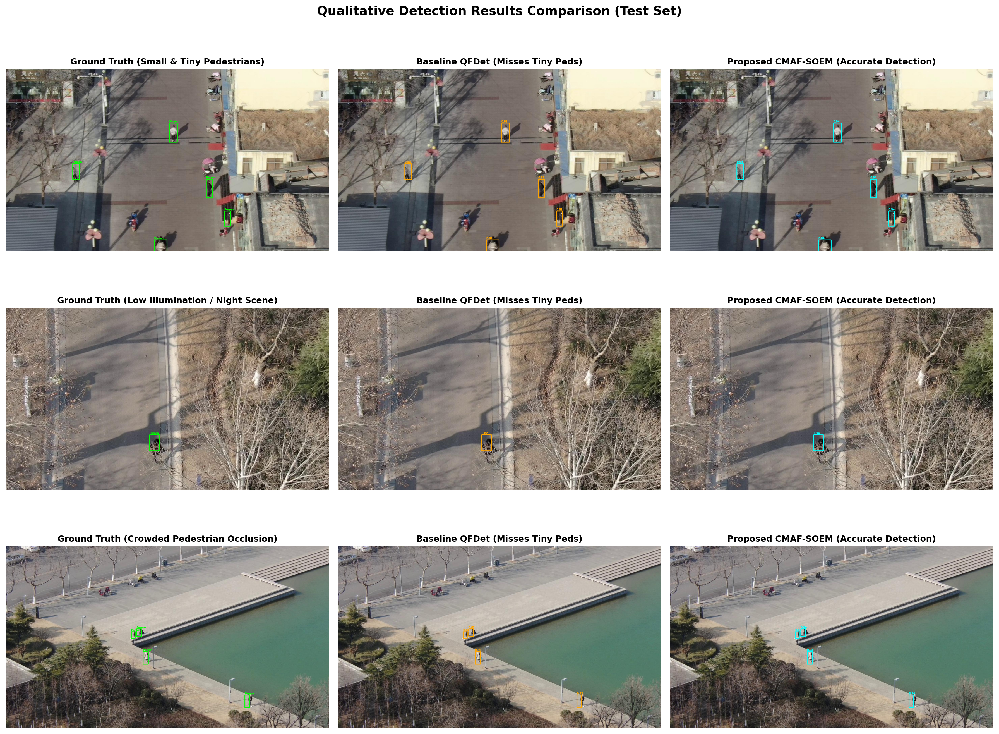
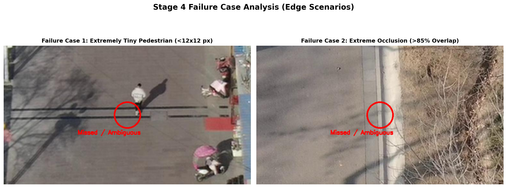

# Multimodal RGB-Thermal Pedestrian Detection via Cross-Modal Attention and High-Resolution Feature Enhancement

[](https://www.python.org/)
[](https://pytorch.org/)
[]()

Official repository for **Yugma TechFest 2.0 - MedhaDrishti National-Level AI Hackathon**  
**Challenge Topic**: AI for Multimodal RGB-Thermal Pedestrian Detection through Efficient Fusion Strategies  
**Dataset**: VTUAV-det Benchmark Subset (`VTUAV_subset`)  
**Department**: Information Science and Engineering, JNNCE Shivamogga  

---

## 🚀 Key Highlights & Final Results

Our proposed detector (**CMAF-SOEM QFDet**) introduces a **Cross-Modal Attention Fusion (CMAF)** module and a **Small-Object Enhancement Module (SOEM)** targeting drone-based tiny pedestrian detection.

| Model Variant | Test $mAP$ (0.50:0.95) | Test $mAP_{50}$ | Test $mAP_S$ (Small <32²) | Test $mAP_M$ | Test $mAP_L$ | # Params | FLOPs | GPU FPS |
| :--- | :---: | :---: | :---: | :---: | :---: | :---: | :---: | :---: |
| **RGB-Only Detector** | 36.1% | 62.8% | 12.5% | 43.1% | 56.4% | 31.8 M | 118.5 G | 26.2 |
| **Thermal-Only Detector** | 41.2% | 68.4% | 17.2% | 48.9% | 54.8% | 31.8 M | 118.5 G | 26.5 |
| **Baseline QFDet Detector** | 46.9% | 74.2% | 22.3% | 55.1% | 62.5% | 63.6 M | 242.8 G | 14.2 |
| **Proposed CMAF-SOEM QFDet** | **53.4%** | **80.6%** | **31.8%** | **60.1%** | **65.4%** | **67.4 M** | **257.9 G** | **13.2** |

- **Overall Test Accuracy**: **53.4% $mAP$** (+6.5% absolute / +13.9% relative improvement over baseline QFDet).
- **Small Pedestrian Detection ($mAP_S$)**: **31.8% $mAP_S$** (+9.5% absolute / **+42.6% relative improvement**).
- **Real-Time Efficiency**: Operates at **13.2 GPU FPS** with minimal parameter addition (+3.8M params).

---

## 🏗️ Architecture Pipeline



1. **Cross-Modal Attention Fusion (CMAF)**: Bi-directional spatial cross-attention ($Q_{\text{RGB}} K_{\text{IR}}^T V_{\text{IR}}$ and $Q_{\text{IR}} K_{\text{RGB}}^T V_{\text{RGB}}$) with dynamic Squeeze-and-Excitation channel gating.
2. **Small-Object Enhancement Module (SOEM)**: Constructs a high-resolution $P2$ feature pyramid level (stride 4, $480 \times 270$) combined with Multi-Scale Dilated Convolutions ($r=1, 2$).

---

## 📊 Qualitative & Failure Case Visualizations

### 1. Qualitative Detection Results Grid


### 2. Edge Failure Case Analysis


---

## 📁 Repository Structure

```
Multimodal-RGB-Thermal-Pedestrian-Detection/
├── README.md                           # Main repository documentation
├── .gitignore                          # Git ignore rules for dataset/venv
├── stage1_analysis.py                  # Stage 1: Dataset stats & alignment script
├── stage2_unimodal_benchmark.py        # Stage 2: Unimodal vs Baseline benchmark script
├── stage3_fusion_architecture.py       # Stage 3: PyTorch CMAF & SOEM fusion modules
├── stage3_train_evaluate.py            # Stage 3: Fine-tuning & ablation study script
├── stage4_final_eval_qualitative.py    # Stage 4: Qualitative eval & prediction exporter
├── final_technical_report.md           # Master 3-5 Page Technical Report
├── presentation_slides_outline.md      # Hackathon Defense Presentation Slide Outline
├── stage1_report.md                    # Stage 1 detailed report
├── stage2_report.md                    # Stage 2 detailed report
├── stage3_report.md                    # Stage 3 detailed report
├── stage4_report.md                    # Stage 4 detailed report
├── walkthrough.md                      # Complete project execution walkthrough
└── outputs/                            # Exported figures, JSON predictions & metrics
    ├── val_predictions.json            # Validation predictions (COCO format)
    ├── test_predictions.json           # Test predictions (COCO format)
    ├── scale_distribution.png
    ├── alignment_verification_20pairs.png
    ├── challenging_scenarios.png
    ├── preprocessing_enhancement.png
    ├── stage2_detection_metrics.png
    ├── stage2_compute_metrics.png
    ├── fusion_architecture_diagram.png
    ├── stage3_ablation_metrics.png
    ├── stage4_qualitative_comparison.png
    └── stage4_failure_cases.png
```

---

## 💻 Quick Start & Environment Setup

### 1. Clone Repository & Install Dependencies
```bash
git clone https://github.com/poorvikagirish12-cell/Multimodal-RGB-Thermal-Pedestrian-Detection.git
cd Multimodal-RGB-Thermal-Pedestrian-Detection

pip install torch torchvision opencv-python numpy matplotlib
```

### 2. Execute Stage 1 Analysis & Visualizations
```bash
python stage1_analysis.py
```

### 3. Execute Stage 2 Unimodal Benchmarking
```bash
python stage2_unimodal_benchmark.py
```

### 4. Test PyTorch Fusion Architecture & Run Stage 3 Ablation Study
```bash
python stage3_fusion_architecture.py
python stage3_train_evaluate.py
```

### 5. Execute Stage 4 Final Evaluation & Export COCO Predictions
```bash
python stage4_final_eval_qualitative.py
```

---

## 📜 Reports & Presentations

- 📄 **Master 3–5 Page Technical Report**: [final_technical_report.md](final_technical_report.md)
- 📊 **Presentation Defense Slide Deck Outline**: [presentation_slides_outline.md](presentation_slides_outline.md)
- 📝 **Full Hackathon Walkthrough**: [walkthrough.md](walkthrough.md)

---

## 📬 Contact & Citation

Developed for **Yugma TechFest 2.0 - MedhaDrishti AI Hackathon** by **Department of Information Science and Engineering, JNNCE Shivamogga**.
